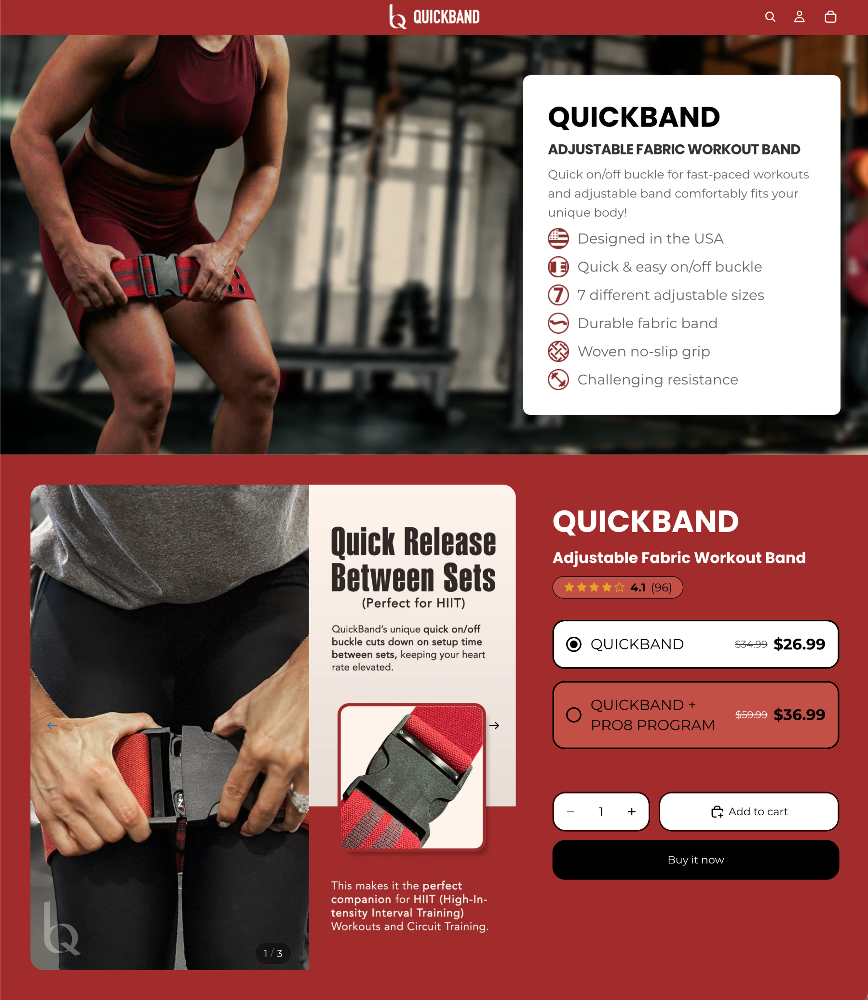
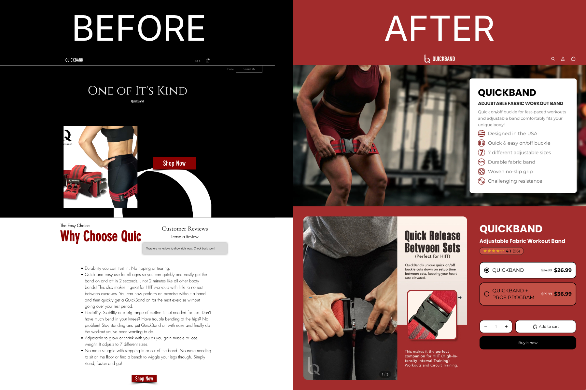
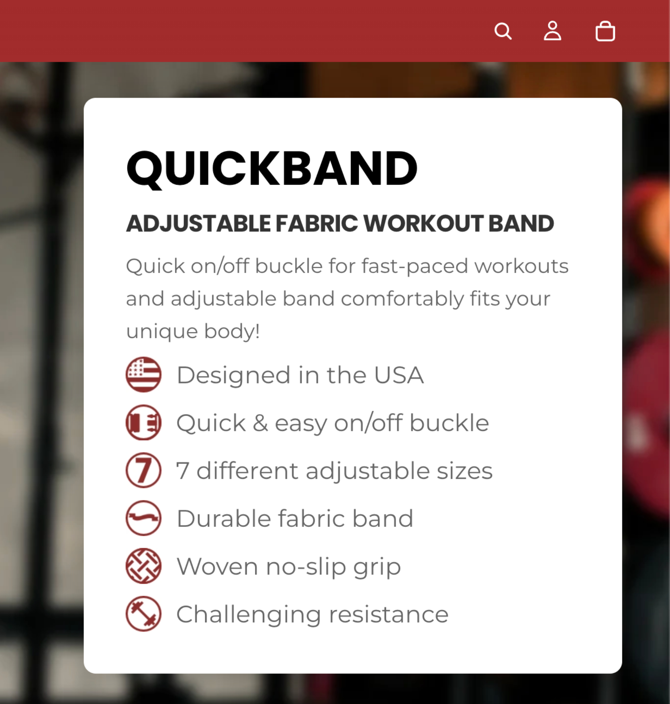
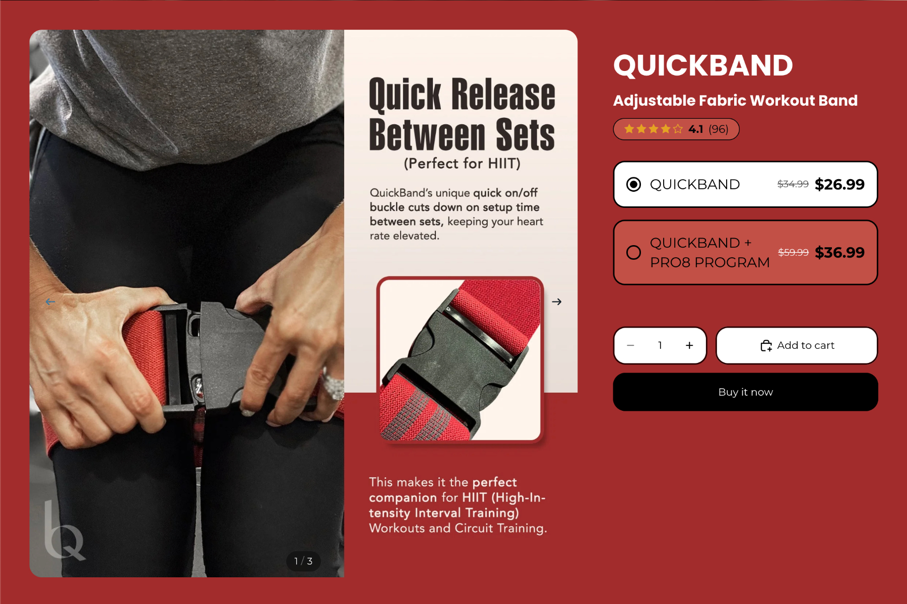
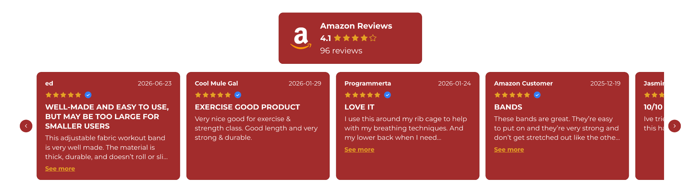
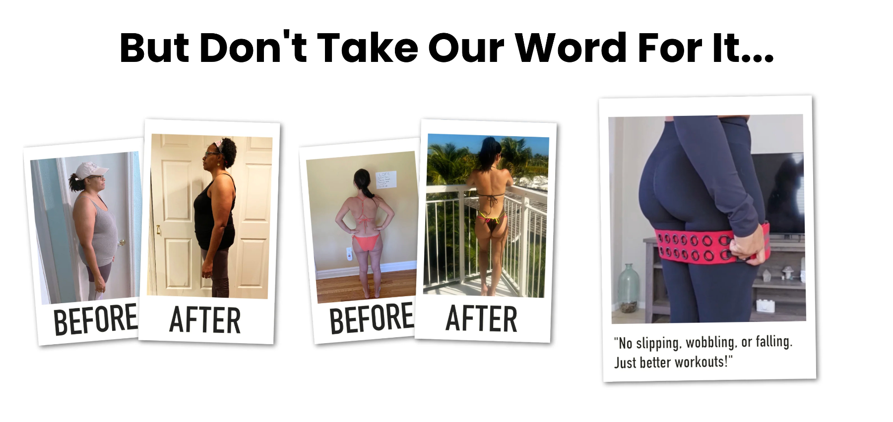
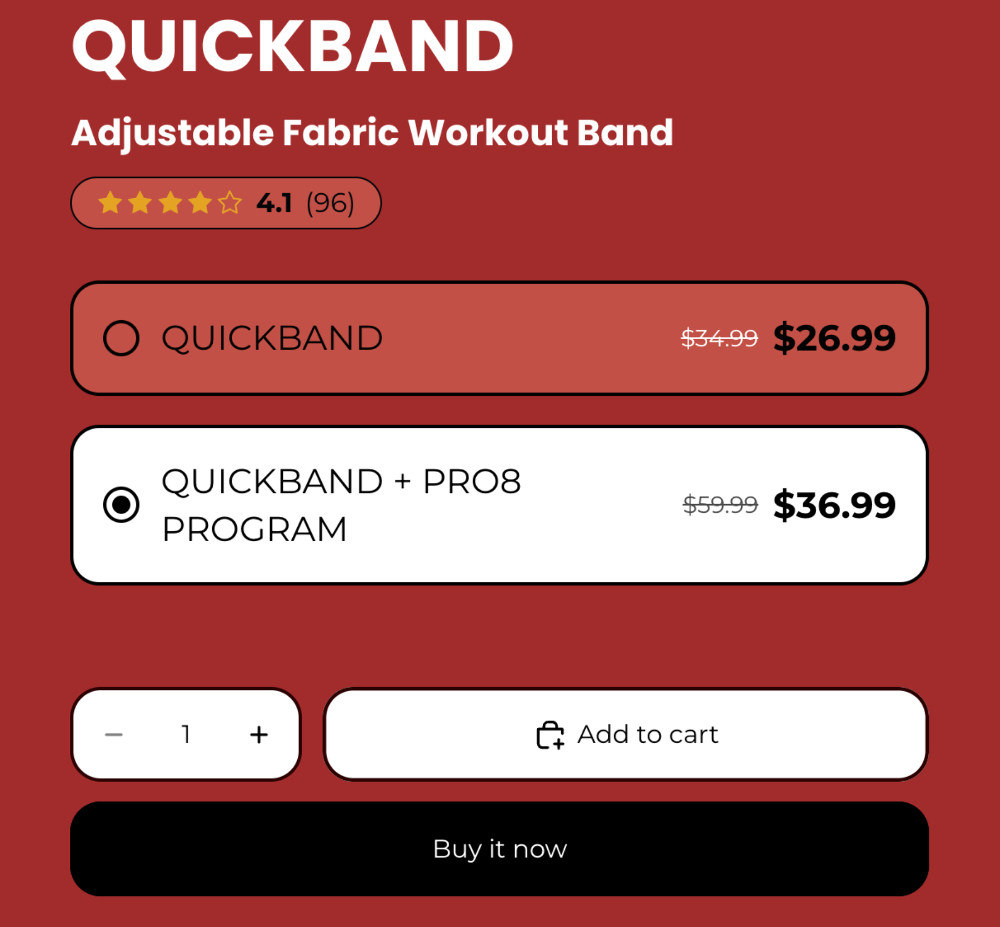
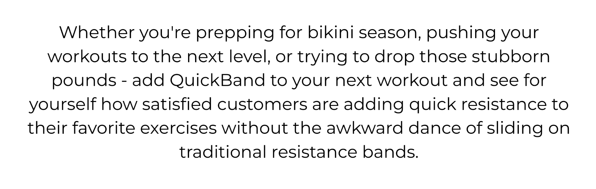
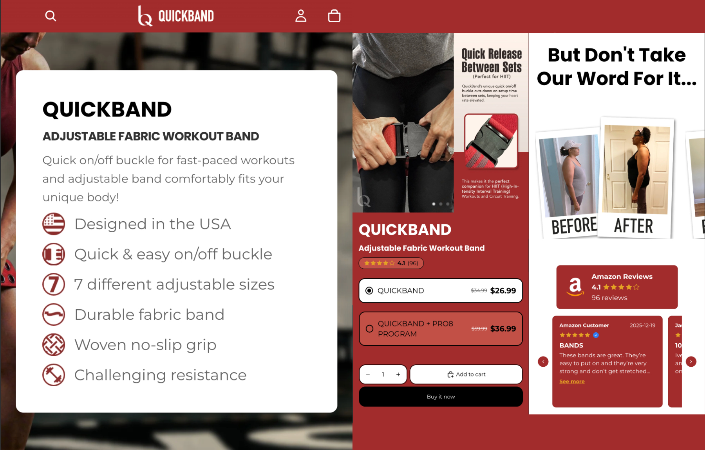

# quickband-shopify-theme
Repository for QuickBand's One-Page Shopify Theme
# QuickBand

## Introducing a New Product Category While Building Trust and Raising AOV

**A conversion-focused Shopify build designed to explain a first-to-market product quickly, overcome new-product hesitation, and turn an existing digital asset into a higher-value offer.**

### Live Shopify Preview

**Store:** https://quickband-ihjfy7ss.myshopify.com/  
**Password:** `loveey`

> This storefront is maintained as a portfolio/demo environment.

| | |
|---|---|
| **Platform** | Shopify |
| **Focus** | Product education, social proof & AOV optimization |
| **Conversion Challenge** | First-to-market product with limited off-marketplace proof |
| **Offer Strategy** | Physical product + digital training program upsell |
| **Integration** | Custom Amazon Review Porting System |

---

# The Opportunity

QuickBand suffered from an all-too-common ecommerce experience. Their Shopify presented the product but did very little to actively sell it.

Product imagery was inconsistently formatted, crops felt awkward, social proof was largely absent, calls to action were weak or missing, and the experience lacked the emotional hooks needed to move shoppers from interest to action.

Above all, the project faced three larger business challenges.

## 1. Explain Something New — Fast

QuickBand was introducing a first-to-market product.

That meant customers couldn't be expected to immediately understand what made it different, why those differences mattered, or why they needed it.

## 2. Reduce New-Product Risk

An unfamiliar product creates hesitation.

Customers needed evidence that other people had already tried it, benefited from it, and weren't regretting the decision.

## 3. Increase Order Value

The physical product operated on tight margins.

Simply improving conversion wasn't enough. The buying experience also needed to create a credible path toward a higher-value order.

**Education → Trust → Higher-Value Purchase**

became the foundation for the Shopify experience.

---

# Explain the Product Before the Customer Leaves

New product launches create a specific conversion problem:

**Customers can't buy what they don't understand.**

It is easy to spread product education across multiple pages, FAQs, pop-ups, image galleries, and long sections of copy.

We deliberately took the opposite approach.

The goal was to communicate the core product concept as quickly as possible and keep the primary sales argument tight.

---

# Fast-Path Product Education

The opening hero was customized around rapid product comprehension.

A purpose-built feature system pairs concise copy with original icons designed to visually correspond with what the customer is seeing in the hero imagery.

Instead of requiring the shopper to:

- Open additional information
- Click through pop-ups
- Swipe through multiple images
- Read long supporting sections
- Leave the primary sales flow

the hero begins explaining the product immediately.

**The objective was simple: reduce the time required to understand what makes Quick Bands different.**

---

# Premium Positioning From the First Impression

Quick Bands needed to feel like legitimate fitness equipment rather than a novelty product.

The hero therefore uses a darker, almost gritty gym environment and a strong female athlete.

The intent was deliberate.

Rather than presenting another generic "fitness lifestyle" image, the creative establishes that the product belongs in a serious training environment.

From there, the storefront uses clean, modern architecture with a red-led palette and warmer supporting tones.

The experience is designed to feel:

**Premium · Durable · Modern**

without becoming cold or sterile.

---

# Show It in Use, Then Let Them Buy

After the opening education, the experience moves quickly into the product.

The first purchase section introduces marketplace validation through Amazon review proof while a compact three-image sequence demonstrates the product in actual use.

The imagery focuses on practical differentiators including:

- Easy on/off functionality
- Adjustability
- Ease of use
- Adaptability across different customers and use cases

## Testing Different Conversion Angles

The image stack was also designed with experimentation in mind.

Rather than assuming one creative direction would resonate best with every shopper, we developed alternate image sequences around different conversion hypotheses.

One stack leaned more heavily into **women's use cases, pregnancy, accessibility, and everyday practicality**.

A second version used a more **medical / clinical framing**, emphasizing product function, credibility, and a more technical interpretation of the same core benefits.

The objective was to compare how different positioning strategies influenced conversion behavior rather than treating creative direction as a purely subjective design decision.

**Creatives weren't just produced to look good. They we're built to test.**

---

# Social Proof Before Skepticism Takes Over

A first-to-market product creates an additional burden of proof.

Customers aren't only asking:

**"Will this work for me?"**

They're also asking:

**"Has anyone else actually tried this?"**

QuickBand hadn't received reviews for their Shopify yet, but this social proof is critical, so we integrated a powerful, custom-built Amazon review-porting system that we developed to bring existing marketplace proof into the DTC experience.

### Technical Repository

[**View the Custom Amazon Review Porting System →**](https://github.com/JacobEcom/shopify-amazon-review-porting-system)

---

# Transformational Proof

Marketplace reviews establish credibility.

Visual transformations make the potential outcome tangible.

Before-and-after case-study imagery is introduced before the larger review section so shoppers can see evidence of change before being asked to process a larger body of testimonials.

---

# AOV Optimization Through Offer Architecture

Improving conversion was only part of the business problem.

Because product margins were tight, the storefront also needed a way to increase average order value.

The client already had a digital training program used elsewhere in the business.

We identified an opportunity to integrate that existing asset into the Shopify offer as a higher-value upsell.

The purchase experience presents:

**Quick Bands Product**

and

**Quick Bands + Digital Training Program**

directly inside the action area.

The higher-value bundle is selected by default.

Pricing and strike-through pricing remain visually connected to the corresponding choice and purchase action rather than being separated elsewhere on the page.

The selected bundle receives a bright, high-contrast treatment, while the standalone product is visually quieter.

Customers remain free to choose either option.

But the interface makes the higher-value offer the clearest default path.

---

# Designing the Default

The bundle treatment uses several behavioral cues at the same moment:

### Default Selection
The higher-value offer is already selected when the shopper arrives.

### Visual Priority
The selected bundle uses stronger contrast while the lower-value option visually recedes.

### Price + Action Proximity
Pricing, savings, selection state, and the action itself remain grouped together.

### Choice Is Preserved
The standalone product remains easily available for customers who prefer it.

The objective isn't to hide the cheaper offer.

It's to make the **preferred offer easier to recognize, understand, and choose.**

---

# A Tight Conversion Journey

QuickBand was intentionally designed to avoid unnecessary page depth.

The primary journey is:

**Understand the Product**

↓

**See It in Real Use**

↓

**Encounter Marketplace Proof**

↓

**Receive an Early Purchase Opportunity**

↓

**See Transformational Evidence**

↓

**Read Deeper Customer Proof**

↓

**Return to Purchase**

Customers who continue all the way to the bottom of the experience encounter a final CTA directing them back toward the primary purchase area rather than leaving them at a dead end.

---

# Beyond the Stock Theme

QuickBand used Shopify's Ritual theme as the foundation, but the conversion strategy dictated the experience.

Theme-level customization and purpose-built sections were used to support:

- Fast-path product education
- Original icon-led feature communication
- AOV-focused purchase selection
- Higher-value bundle prioritization
- Marketplace review integration
- Conversion-focused page sequencing

The objective wasn't customization for its own sake.

**The theme was adapted where the customer journey required it.**

---

# Designed With Mobile in Mind

The same principle applied to mobile:

keep the experience clear, fast, and easy to understand.

Product education, visual hierarchy, purchase options, and social proof needed to remain comprehensible on smaller screens without requiring customers to work harder to understand a new product.

---

# Project Scope

### Strategy & CRO

Product-launch conversion strategy · Buyer education · Conversion architecture · Trust development · Social-proof strategy · AOV optimization · Offer architecture · Product presentation strategy · Sales copy

### Creative

Creative direction · Hero positioning · Original feature iconography · Product-use imagery · Transformation proof · Responsive asset design

### Shopify

Theme customization · Purpose-built Shopify sections · Purchase-flow modifications · Bundle-offer presentation · Amazon review integration · Responsive implementation

---

# Technical Stack

**Platform:** Shopify  
**Base Theme:** `Ritual`  
**Frontend:** Liquid · HTML · CSS · JavaScript  
**Theme Work:** Theme customization · Purpose-built sections · Purchase-flow modifications  
**Development & Integration:** Custom Amazon Review Porting System

---

# Featured Implementation

### Amazon Review Integration App

[**View the Custom Amazon Review Porting System →**](https://github.com/JacobEcom/shopify-amazon-review-porting-system)

---

# About Ecom Optimization

**Ecom Optimization combines conversion strategy, buyer psychology, creative, and Shopify development to build ecommerce experiences designed around how customers actually make purchase decisions.**

Development determines what an ecommerce experience *can* do.

Conversion strategy determines whether customers care.

[**Book a call with Sean to see how we can grow your Shopify together →**](https://api.leadconnectorhq.com/widget/otl/REF4zhgVC?slug=sean-farrington76t4ol)

---

## Explore the Live Build

The Live preview leads to a preserved development version that is maintained as a live portfolio environment so prospects can inspect the complete customer experience.

**Shopify Preview:**  
https://quickband-ihjfy7ss.myshopify.com/

**Password:** `loveey`

<!--
FINAL JACOB CHECKLIST

7. Verify every /docs filename and capitalization.

8. Test the Shopify preview and password from an incognito/logged-out browser.

9. Test all GitHub links.

10. Review the public README as a prospect:
- Does the product become understandable quickly?
- Is the AOV strategy obvious?
- Does the work look premium?
- Is the distinction between portfolio build and launched client work clear?
-->
